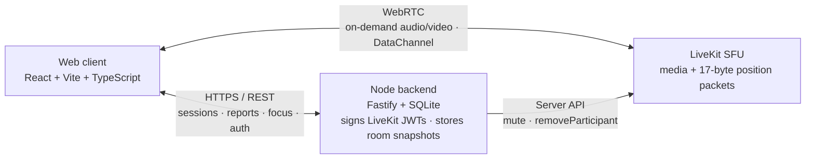

# Open Study Room — 免费开源虚拟自习室

> **What**: a 2D virtual study room — "study with strangers". Walk an avatar
> into a quiet hall, sit down, start a focus session, and feel the presence of
> others studying alongside you. Talk only in discussion / rest zones.
>
> **中文**：免费开源的虚拟自习室——"和陌生人一起自习"。化身走进安静的自习大厅，
> 选座坐下、开启专注，感受周围人一起学习的陪伴感；只在讨论区 / 休息区交谈。

**Languages:** [English](#english) · [中文](#中文)

> **Changelog — 2026-09-29**: the Kotlin Android client (`app/`) was removed.
> Open Study Room is now **Web + Server** only. Mobile goes through phone browsers
> (the web client is heading toward touch-friendly controls); a Capacitor
> shell around the web client remains an option if native push / background
> audio is ever needed.

---

## Architecture



| Part | Stack | Role |
|------|-------|------|
| `web/` | React + Vite + TypeScript, zustand | 2D spatial canvas, zone audio policy, table meetings, map editor |
| `server/` | Node 20 + Fastify + LiveKit Server SDK + SQLite | Signs LiveKit JWTs, ingests per-room state (position/table/zone), server-side mute in silent zones |
| LiveKit | `livekit-server` via `docker-compose.yml` | SFU for audio/video + data channel |

Product principles (see roadmap): **quiet by default** (silent zones force-mute,
server-side), **publish nothing by default** (no mic/camera tracks on join —
keeps SFU cost near zero so the free model survives).

Shared wire contracts (room regex, nickname/color rules, 17-byte position
packet, zone kinds, LiveKit attribute keys) live in
[docs/contracts.md](docs/contracts.md) — keep web and server in sync when
changing them.

## Quick start

One command brings up the full stack (from repo root):

```bash
docker compose up --build -d   # web :8080 · server :8787 · livekit :7880
# Open http://localhost:8080
```

Hacking on the client with hot reload instead:

```bash
docker compose up --build -d livekit server   # backend only
cd web
cp .env.example .env
npm install
npm run dev                    # http://localhost:5173
```

### Phone on the same Wi-Fi

Two URLs must point at your host's LAN IP — `localhost` on the phone means
the phone itself:

| URL | Where it's set | Why |
|-----|---------------|-----|
| `VITE_BACKEND_URL` | **build arg** (baked into the web bundle by Vite at build time) | web client → backend REST |
| `LIVEKIT_URL` | server env (echoed to clients in `/v1/sessions` responses) | phone → LiveKit WebRTC |

```bash
IP=192.168.1.42   # <- your host's LAN IP (ipconfig / ifconfig / ip addr)
VITE_BACKEND_URL=http://$IP:8787 LIVEKIT_URL=ws://$IP:7880 \
  docker compose up --build -d
# Phone browser → http://192.168.1.42:8080
```

World assets (`assets/map_config.json`, `room1.jpg`, `sprites/`) are copied
into `web/public/` by `npm run sync-assets` (runs automatically via
`predev`/`prebuild`).

## Demo

A 42-second screen recording of two users in the library template: joining,
walking to the discussion corner, sitting at a table, and starting a focus
session. Recorded locally with the real stack (LiveKit `--dev` + Node server +
production web build, driven by Playwright).

<video src="docs/demo.mp4" width="640" controls></video>

> **Note**: recorded in a sandboxed environment without UDP. WebRTC ICE could
> not establish (LiveKit's TCP mux did not service inbound connections), so
> peer position sync via data channel is not visible; the UI journey itself is
> real. The whiteboard open was flaky under automation and is not shown.

## Tests

```bash
cd web && npx vitest run       # unit tests
cd server && npm test          # route/contract tests
```

---

<a id="english"></a>
## English

**Open Study Room** is a free, open-source virtual study room. Instead of scheduled
calls, you walk a 2D avatar into a study hall: silent zones keep everyone
muted (enforced server-side), discussion zones allow distance-attenuated
proximity voice, and sitting at a table starts a focus session.

### Why a study room?

1. **Lower friction than study livestreams** — no host, no streaming setup;
   just walk in and sit down.
2. **Presence without pressure** — see others focusing around you; talk only
   where talking is allowed.
3. **Free forever** — quiet-by-default architecture keeps server costs near
   zero; self-hostable with one `docker compose` command.

### Features

- **Quiet semantics (M1)** — zones carry `kind: silent | discussion | rest`;
  silent entry force-mutes locally AND server-side (`mutePublishedTrack`);
  Space = push-to-talk in silent zones.
- **True spatial audio** — linear distance attenuation (`maxDistance=300`) in
  discussion/rest zones.
- **Table meetings** — sit at a table to join its video grid; speaker halo,
  reactions.
- **Map editor** — annotate zones, place portals/notes; touch controls for
  phone browsers are on the roadmap.
- **Chat** — global / table / zone / DM / channel scopes.

See [web/README.md](web/README.md) and [server/README.md](server/README.md)
for component details.

---

<a id="中文"></a>
## 中文

**Open Study Room** 是免费开源的虚拟自习室。不用约会议：化身走进 2D 自习大厅，
silent 区强制静音（服务端执行）、discussion 区按距离衰减语音、
坐下即进入专注。

### 为什么做自习室？

1. **比学习直播间更低的摩擦** — 不用当主播、不用开播，走进来坐下就行。
2. **有陪伴无压力** — 看到周围人都在专注；只在允许交谈的区域说话。
3. **永远免费** — 默认安静的架构让服务器成本接近零；一条
   `docker compose` 命令即可自建。

### 功能特性

- **安静语义（M1）** — zone 自带 `kind: silent | discussion | rest`；
  进入 silent 区本地+服务端双重静音；空格 = silent 区按住说话。
- **真空间音频** — discussion/rest 区内按距离线性衰减（`maxDistance=300`）。
- **桌子会议** — 坐下加入该桌视频宫格；说话者光环、reaction。
- **地图编辑器** — 标注 zone、放置传送门/便签；手机浏览器触屏操作在路线图上。
- **聊天** — global / table / zone / DM / channel 五种范围。

组件详情见 [web/README.md](web/README.md) 与 [server/README.md](server/README.md)。

---

## Related docs

| File | Description |
|------|-------------|
| [docs/contracts.md](docs/contracts.md) | Shared wire contracts (web ↔ server) |
| [design-system/syncle/MASTER.md](design-system/syncle/MASTER.md) | Design tokens |
| [assets/](assets/) | World assets (map config, background, sprites) |
